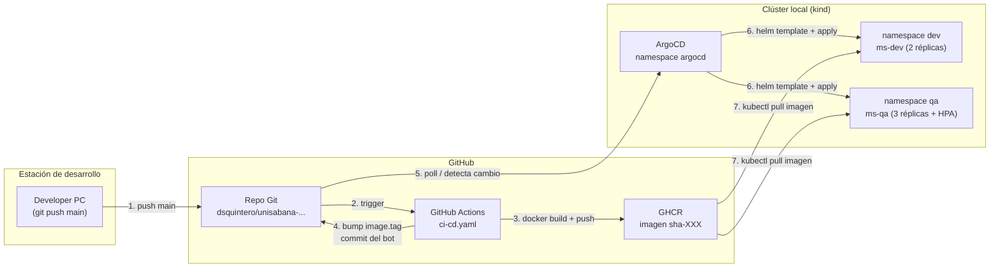
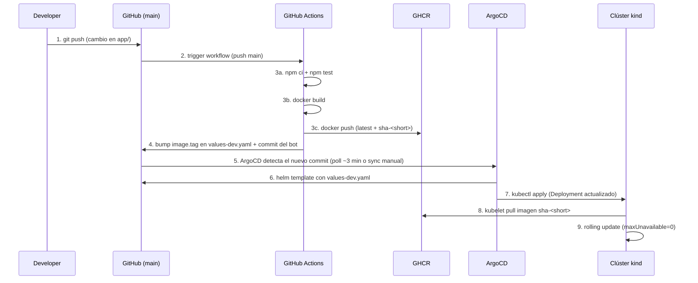
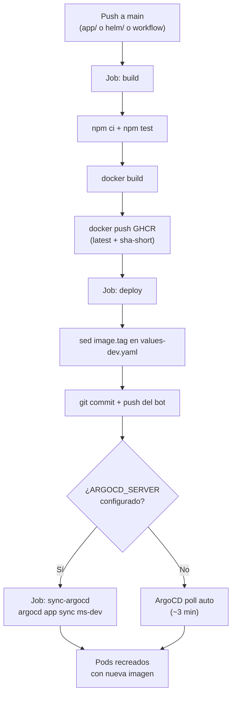

# Actividad 3 — Microservicio en Kubernetes con Helm, ArgoCD y CI/CD


Trabajo de la asignatura **Arquitectura de Software**: despliegue de un
microservicio Node.js en un clúster Kubernetes local (kind) usando contenedores
**Docker**, charts de **Helm**, **ArgoCD** (GitOps) y un pipeline de CI/CD con
**GitHub Actions** que publica imágenes en GHCR (GitHub Container Registry).

---

## Tabla de contenidos

- [Contexto académico](#contexto-académico)
- [Stack tecnológico](#stack-tecnológico)
- [Arquitectura](#arquitectura)
- [Flujo GitOps end-to-end](#flujo-gitops-end-to-end)
- [Estructura del repositorio](#estructura-del-repositorio)
- [Microservicio Node.js](#microservicio-nodejs)
- [Chart de Helm](#chart-de-helm)
- [ArgoCD](#argocd)
- [Pipeline CI/CD](#pipeline-cicd)
- [Clúster kind](#clúster-kind)
- [Requisitos previos](#requisitos-previos)
- [Guía de reproducción paso a paso](#guía-de-reproducción-paso-a-paso)
- [Makefile](#makefile)
- [Endpoints de ejemplo](#endpoints-de-ejemplo)
- [Secretos opcionales en GitHub Actions](#secretos-opcionales-en-github-actions)
- [Matriz de cumplimiento de la rúbrica](#matriz-de-cumplimiento-de-la-rúbrica)
- [Limpieza](#limpieza)
- [Autor y licencia](#autor-y-licencia)

---

## Contexto académico

**Asignatura:** Arquitectura de Software
**Actividad:** Trabajo K8S (4 horas estimadas)
**Indicador de desempeño:** Diseñar arquitecturas de software utilizando estilos y
patrones arquitectónicos reconocidos, asegurando que las soluciones propuestas
sean escalables, mantenibles y alineadas con los requisitos técnicos y del negocio.

### Pasos del enunciado

1. Construir un microservicio básico y dockerizarlo.
2. Crear charts de Helm con valores por defecto y overrides por entorno.
3. Desplegar ArgoCD en el clúster y configurar el repo Git como fuente.
4. Automatizar el despliegue con un pipeline CI/CD que detecte commits.

### Entregables

- Código fuente en este repositorio.
- Video presentando el resultado.

---

## Stack tecnológico

| Herramienta          | Rol en el proyecto                                     | Versión usada |
|----------------------|--------------------------------------------------------|---------------|
| Docker               | Construcción de la imagen del microservicio (multi-stage, non-root) | 29.x |
| Kubernetes (kind)    | Clúster local de un nodo para el laboratorio           | v1.30.0       |
| Helm                 | Empaquetado del microservicio como chart reutilizable  | v3.21.2       |
| ArgoCD               | GitOps: sincroniza Git con el clúster automáticamente  | v2.11         |
| GitHub Actions       | Pipeline CI/CD: build, test, push GHCR, bump GitOps   | hosted        |
| GHCR                 | Registro de contenedores público para la imagen        | -             |
| Node.js / Express    | Microservicio con endpoints /healthz, /api, /env      | v22           |
| metrics-server       | Métricas de CPU para el HPA del entorno qa             | latest        |

---

## Arquitectura



<details>
<summary>Diagrama en texto (ASCII)</summary>

```
+----------------+      push main       +-------------------+   build + push
|  Developer PC  | -------------------> |  GitHub (main)     | ------------->  GHCR
|  (local kind)  |                      |  .github/workflows |                |
|       ^        |                      |  ci-cd.yaml        |                v
|       |  sync  |                      +-------------------+         +---------------+
|       | (HTTP) |        poll/git                                              | imagen sha-XXX |
+-------+--------+ ----------------+---------------+                            +---------------+
        |                          |
+-------+--------+       +---------+----------+
|  ArgoCD        |       |  kind cluster       |
|  Application   | ----> |  ns: dev, ns: qa    |
|  ms-dev ms-qa  |       |  Deployment + Svc   |
+----------------+       |  ConfigMap + HPA(qa)|
                         +---------------------+
```
</details>

### Componentes clave

- **GitHub (repo + Actions + GHCR):** fuente de verdad del código y la
  configuración (Helm values). El pipeline construye y publica la imagen y
  actualiza el tag en Git.
- **ArgoCD:** observa el repo y aplica los manifiestos renderizados del chart
  de Helm en el clúster. Desacopla al pipeline del clúster (GitOps puro).
- **kind:** clúster Kubernetes local de un nodo con NodePorts mapeados al host
  para acceso directo desde el navegador/terminal.

---

## Flujo GitOps end-to-end



### Explicación del desacoplamiento

El pipeline **no toca el clúster directamente**. Su única responsabilidad es
construir la imagen, publicarla y actualizar el tag en Git. ArgoCD es el
componente que observa Git y reconcilia el estado del clúster. Esto significa:

- **Auditable:** todo cambio pasa por Git (commits revisables).
- **Reversible:** `git revert` revierte el despliegue.
- **Idempotente:** ArgoCD con `selfHeal` corrige cualquier drift manual.

---

## Estructura del repositorio

```
.
├── app/                           # Microservicio Node.js + Docker
│   ├── server.js                  # Express: /healthz, /api, /api/:nombre, /env
│   ├── package.json
│   ├── Dockerfile                 # Multi-stage node:22-slim, non-root
│   ├── .dockerignore
│   └── test/
│       └── health.test.js         # Smoke test (Node 22 test runner)
├── helm/microservicio/            # Chart de Helm
│   ├── Chart.yaml                 # Metadatos del chart (v0.1.0, appVersion 1.0.0)
│   ├── values.yaml                # Valores por defecto
│   ├── values-dev.yaml            # Override DEV (2 réplicas, NodePort 30080)
│   ├── values-qa.yaml             # Override QA (3 réplicas, HPA + Ingress)
│   ├── values-kind.yaml           # Override local para kind (imagen local)
│   └── templates/
│       ├── _helpers.tpl           # Labels y env reutilizables
│       ├── configmap.yaml         # ConfigMap con APP_ENV, APP_VERSION, APP_MESSAGE
│       ├── deployment.yaml        # Deployment con probes, resources, securityContext
│       ├── service.yaml           # Service ClusterIP o NodePort
│       ├── ingress.yaml           # Ingress (habilitado en qa)
│       └── hpa.yaml               # HorizontalPodAutoscaler (habilitado en qa)
├── argocd/
│   ├── application.yaml           # ArgoCD Application ms-dev (auto-sync)
│   └── application-qa.yaml        # ArgoCD Application ms-qa (auto-sync)
├── .github/workflows/
│   └── ci-cd.yaml                 # Pipeline: build, test, push GHCR, bump, sync
├── kind-config.yaml               # Clúster kind: 1 nodo + NodePorts 30080/30081/30043
├── Makefile                       # Atajos de operación (install, cluster, deploy, ...)
└── README.md                      # Este documento
```

---

## Microservicio Node.js

El microservicio es una aplicación Express mínima que expone endpoints
diseñados para demostrar contenedores, ConfigMaps y GitOps.

### Endpoints

| Ruta            | Método | Descripción                                      | Ejemplo de respuesta                          |
|-----------------|--------|--------------------------------------------------|-----------------------------------------------|
| `/healthz`      | GET    | Sonda de vitalidad (liveness/readiness de K8s)   | `{"status":"ok"}`                            |
| `/api`          | GET    | Información del servicio: versión, entorno, host | `{"service":"microservicio-k8s","version":"1.0.0",...}` |
| `/api/:nombre`  | GET    | Saludo personalizado (útil para demo interactiva) | `{"saludo":"Hola 'Mundo' ...","hostname":"ms-dev-..."}` |
| `/env`          | GET    | Variables APP_* inyectadas por el ConfigMap      | `{"environment":"dev","appEnv":{"APP_ENV":"dev",...}}` |

### Variables de entorno (inyectadas por el ConfigMap de Helm)

| Variable       | Origen                | Descripción                          |
|----------------|-----------------------|--------------------------------------|
| `APP_PORT`     | Deployment (fix 3000) | Puerto del contenedor                |
| `APP_ENV`      | ConfigMap             | Nombre del entorno (dev / qa)       |
| `APP_VERSION`  | ConfigMap             | Versión de la app                    |
| `APP_MESSAGE`  | ConfigMap             | Mensaje configurable (demo GitOps)  |

### Dockerfile

Multi-stage con dos fases:

1. **builder:** `node:22-slim`, instala dependencias de producción con
   `npm install --omit=dev`.
2. **runner:** `node:22-slim` con `curl` para healthchecks, usuario `node`
   (non-root), `HEALTHCHECK` sobre `/healthz`, `CMD ["node","server.js"]`
   en forma exec para recibir `SIGTERM` y hacer graceful shutdown.

---

## Chart de Helm

El chart empaqueta el microservicio con plantillas para Deployment, Service,
ConfigMap, Ingress y HPA. La personalización por entorno se logra encadenando
archivos de values.

### Comparativa de values por entorno

| Clave                  | `values.yaml` (default) | `values-dev.yaml` | `values-qa.yaml` |
|------------------------|-------------------------|--------------------|------------------|
| `replicaCount`         | 2                       | 2                  | 3                |
| `image.tag`            | `1.0.0`                 | `latest` (bump pipeline) | `1.0.0`   |
| `image.pullPolicy`     | `Always`                | `Always`           | `IfNotPresent`   |
| `service.type`         | `ClusterIP`             | `NodePort` (30080) | `NodePort` (30081) |
| `hpa.enabled`          | `true`                  | `false`            | `true`           |
| `ingress.enabled`      | `false`                 | `false`            | `true` (`ms-qa.local`) |
| `resources.limits.cpu` | `250m`                  | `150m`             | `300m`           |
| `app.message`          | `Hola...`               | `...[DEV]`         | `...[QA]`        |

### Override `values-kind.yaml`

Para el laboratorio local sin acceso a GHCR (antes de que el pipeline publique),
este override apunta `image.repository` a la imagen local cargada con
`kind load docker-image` y `pullPolicy: Never`. Una vez que el pipeline
publica en GHCR, se puede omitir de las Applications de ArgoCD para usar la
imagen pública directamente.

### Plantillas generadas

| Archivo           | Recurso K8s     | Notas                                          |
|-------------------|-----------------|------------------------------------------------|
| `_helpers.tpl`    | -               | Labels, selectorLabels y env reutilizables     |
| `configmap.yaml`  | ConfigMap       | APP_ENV, APP_VERSION, APP_MESSAGE              |
| `deployment.yaml`  | Deployment      | probes, resources, securityContext, RollingUpdate |
| `service.yaml`    | Service         | ClusterIP o NodePort (según entorno)          |
| `ingress.yaml`    | Ingress         | Opcional (habilitado en qa)                    |
| `hpa.yaml`        | HorizontalPodAutoscaler | Opcional (habilitado en qa), CPU 65-70%  |

---

## ArgoCD

### Instalación

ArgoCD se instala en el clúster kind usando el chart oficial de Helm
(`argo/argo-cd`), exponiendo el server con `NodePort 30043`:

```bash
helm install argocd argo/argo-cd \
  --namespace argocd --create-namespace \
  --set server.service.type=NodePort \
  --set server.service.nodePortHttp=30043 \
  --wait
```

### Registro del repositorio Git

El repo se registra explícitamente como fuente de aplicaciones:

```bash
argocd repo add https://github.com/dsquintero/unisabana-arq-soft-actividad-3-k8s
```

### Applications

Dos Applications de ArgoCD gestionan sendos entornos:

| Application | Namespace destino | Values usados          | Auto-sync |
|-------------|-------------------|------------------------|-----------|
| `ms-dev`    | `dev`             | `values-dev.yaml`      | prune + selfHeal |
| `ms-qa`     | `qa`              | `values-qa.yaml` + `values-kind.yaml` | prune + selfHeal |

Ambas apuntan al `repoURL` del repo público, `targetRevision: main` y
`path: helm/microservicio`. El `syncPolicy.automated` con `selfHeal: true`
garantiza que cualquier drift se corrija automáticamente.

---

## Pipeline CI/CD



### Detalle de jobs

| Job             | Qué hace                                               | Condición |
|-----------------|--------------------------------------------------------|-----------|
| `build`         | `npm ci`, `npm test`, `docker build`, `docker push` GHCR | Siempre |
| `deploy`        | `sed` de `image.tag` en `values-dev.yaml`, commit + push del bot | `github.actor != github-actions[bot]` |
| `sync-argocd`   | `argocd app sync ms-dev` (sync inmediato)              | Si `vars.ARGOCD_SERVER` está definido |

### Trigger

```yaml
on:
  push:
    branches: [main]
    paths:
      - "app/**"
      - "helm/microservicio/**"
      - ".github/workflows/ci-cd.yaml"
```

### Permisos

```yaml
permissions:
  contents: write   # commit del bot (bump tag)
  packages: write   # push a GHCR
  actions: read
```

### Anti-loop

El job `deploy` tiene `if: github.actor != 'github-actions[bot]'` para que el
commit del bot no vuelva a disparar el pipeline. Adicionalmente, el mensaje del
commit incluye `[skip ci]`.

---

## Clúster kind

### Configuración (`kind-config.yaml`)

Un único nodo `control-plane` con tres mapeos de puertos:

| Puerto host | Puerto contenedor | Servicio destino            |
|-------------|-------------------|----------------------------|
| 30080       | 30080             | Service NodePort ms-dev     |
| 30081       | 30081             | Service NodePort ms-qa      |
| 30043       | 30043             | ArgoCD server (UI + API)    |

### metrics-server

Se instala metrics-server con el flag `--kubelet-insecure-tls` (necesario en
kind) para que el HPA del entorno qa pueda leer métricas de CPU.

---

## Requisitos previos

| Herramienta  | Versión mínima | Instalación                |
|--------------|----------------|----------------------------|
| Docker       | >= 24          | https://docs.docker.com/   |
| kubectl      | >= 1.30        | `make install-deps`        |
| helm         | >= 3.20        | `make install-deps`        |
| kind         | >= 0.23        | `make install-deps`        |
| argocd CLI   | >= 2.11        | `make install-deps`        |
| Node.js      | >= 22          | https://nodejs.org/        |
| Make         | >= 4.0         | preinstalado en Linux      |

Instalar todas las herramientas de K8s con un solo comando:

```bash
make install-deps
```

Los binarios se instalan en `~/.local/bin` (sin sudo, ya en `PATH`).

---

## Guía de reproducción paso a paso

### 1. Levantar el clúster kind

```bash
make cluster-up
kubectl get nodes           # debe mostrar el nodo Ready
```

### 2. Construir y cargar la imagen del microservicio

```bash
make build                  # docker build -t microservicio-k8s:1.0.0 app/
make load                   # kind load docker-image en el nodo
```

### 3. Despliegue manual con Helm (opcional, sin ArgoCD)

```bash
make deploy-dev
make deploy-qa
kubectl get pods -n dev
kubectl get pods -n qa
curl -s localhost:30080/healthz    # {"status":"ok"}
curl -s localhost:30081/api         # hostname distinto a dev
```

### 4. Instalar ArgoCD y registrar las Applications

```bash
make argocd-up              # instala ArgoCD, expone NodePort 30043
make argocd-apps            # crea ms-dev y ms-qa en ArgoCD

# UI de ArgoCD:
#   http://localhost:30043  (admin / ver password abajo)
#   o vía port-forward: https://localhost:8080

# Obtener password admin:
kubectl -n argocd get secret argocd-initial-admin-secret \
  -o jsonpath="{.data.password}" | base64 -d
```

### 5. Verificar el estado de GitOps

```bash
kubectl get applications -n argocd
# NAME     SYNC STATUS   HEALTH STATUS
# ms-dev   Synced        Healthy
# ms-qa    Synced        Healthy
```

### 6. Demo GitOps (disparar un cambio end-to-end)

```bash
# 1. Haz un cambio en el código (p.ej. app/server.js)
git add .
git commit -m "feat: cambio demo"
git push origin main

# 2. Abre GitHub Actions y observa el pipeline en verde:
#    https://github.com/dsquintero/unisabana-arq-soft-actividad-3-k8s/actions

# 3. ArgoCD detectará el nuevo tag (poll ~3 min) y recreará los pods:
kubectl get pods -n dev -w
```

---

## Makefile

| Target            | Descripción                                          |
|-------------------|------------------------------------------------------|
| `make install-deps` | Instala kubectl, helm, kind, argocd en `~/.local/bin` |
| `make cluster-up`   | Crea el clúster kind + metrics-server               |
| `make cluster-down` | Elimina el clúster kind                             |
| `make build`       | Construye la imagen Docker del microservicio        |
| `make load`        | Carga la imagen en el nodo kind                     |
| `make deploy-dev`  | Despliegue manual con Helm en namespace dev         |
| `make deploy-qa`   | Despliegue manual con Helm en namespace qa          |
| `make undeploy`    | Elimina los releases Helm ms-dev y ms-qa            |
| `make argocd-up`   | Instala ArgoCD en el clúster                        |
| `make argocd-apps` | Crea las Applications de ArgoCD                     |
| `make port-forward`| Port-forward de ArgoCD server a localhost:8080      |
| `make test`        | Ejecuta los tests del microservicio                 |
| `make clean`       | Elimina el clúster y node_modules                   |

---

## Endpoints de ejemplo

```bash
# Healthz (sonda de K8s)
curl -s http://localhost:30080/healthz
# -> {"status":"ok"}

# Información del servicio (entorno dev)
curl -s http://localhost:30080/api
# -> {"service":"microservicio-k8s","version":"1.0.0","environment":"dev",
#     "message":"Hola desde el microservicio K8s [DEV]",
#     "hostname":"ms-dev-microservicio-894cb896c-x5lwj",...}

# Saludo personalizado
curl -s http://localhost:30080/api/Mundo
# -> {"saludo":"Hola 'Mundo' desde el microservicio K8s",
#     "environment":"dev","version":"1.0.0","hostname":"ms-dev-..."}

# Variables de entorno inyectadas por el ConfigMap
curl -s http://localhost:30080/env
# -> {"environment":"dev","appEnv":{"APP_ENV":"dev","APP_VERSION":"1.0.0",
#     "APP_MESSAGE":"Hola desde el microservicio K8s [DEV]","APP_PORT":"3000"}}

# Entorno qa (puerto 30081)
curl -s http://localhost:30081/api
# -> ..."environment":"qa","message":"Hola desde el microservicio K8s [QA]"...
```

---

## Secretos opcionales en GitHub Actions

El job `sync-argocd` del pipeline fuerza un sync inmediato en ArgoCD si se
configuran estos secretos/variables en
**Settings > Secrets and variables > Actions**:

| Nombre              | Tipo   | Descripción                                                        |
|---------------------|--------|--------------------------------------------------------------------|
| `ARGOCD_SERVER`     | Variable | `host:puerto` del server de ArgoCD accesible desde el runner     |
| `ARGOCD_TOKEN`      | Secret  | Token de ArgoCD generado con `argocd account generate-token`      |

Si no se definen, el job se omite y ArgoCD sincroniza por su polling automático
(~3 minutos). Para el laboratorio local no se necesitan.

---

## Matriz de cumplimiento de la rúbrica

| Criterio de la rúbrica                               | Dónde se cumple                                |
|------------------------------------------------------|------------------------------------------------|
| Microservicio completamente funcional                | `app/server.js` + `app/Dockerfile`             |
| Correctamente dockerizado (multi-stage, non-root)   | `app/Dockerfile`                               |
| Charts de Helm bien estructurados                    | `helm/microservicio/templates/`               |
| Personalización de valores por entorno               | `values-dev.yaml` + `values-qa.yaml`          |
| Despliegue en Kubernetes sin errores                | kind + `deployment.yaml` + `service.yaml`     |
| Integración con ArgoCD sin errores                   | `argocd/application.yaml` + `application-qa.yaml` |
| Pipelines completamente automatizados               | `.github/workflows/ci-cd.yaml`                |
| Detectan commits correctamente                       | Trigger `push` rama `main` con path filters  |
| Despliegan sin errores (GitOps)                      | Bot bump tag + ArgoCD auto-sync + selfHeal     |
| Código bien estructurado y comentado                | Comentarios en Dockerfile, server.js, Helm templates, workflow |
| Documentación clara, completa y estructurada        | Este README + `Makefile`                       |
| Video profesional que explica todo el flujo         | Entregado por separado                         |

---

## Limpieza

```bash
make undeploy        # elimina los releases Helm ms-dev y ms-qa
make cluster-down    # elimina el clúster kind por completo
make clean           # elimina el clúster + node_modules
```

---

## Autor y licencia

**Daniel Quintero** — [github.com/dsquintero](https://github.com/dsquintero)

Repositorio: [dsquintero/unisabana-arq-soft-actividad-3-k8s](https://github.com/dsquintero/unisabana-arq-soft-actividad-3-k8s)

Licencia: MIT